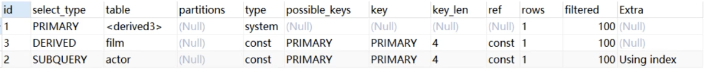

# MySQL之Explain

---

## 用法

基本用法:

**explain yoursql;**

两个变种:

**explain extended yoursql;**

**explain partitions yoursql;**

区别:

explain 输出中包含 partitions 和 filtered 两个字段, 早期 mysql 版本的 explain 工具不会输出这两个字段

使用 explain extended 会在 explain 的基础上额外提供一些查询优化信息, 然后通过 **show warnings** 命令可以得到优化后的查询语句, 从而看出优化器优化了哪些, 其中包括 filtered 列, 是一个半分比的值, rows * filtered / 100 可以估算出将要和 explain 中前一个表进行连接的行数(前一个表指 explain 中的 id 值比当前表 id 值小的表)

> show warnings 会输出优化过后的伪sql, 有可能能直接执行, 也有可能无法执行, 参考即可
>
> show warnings 输出显示 extended 会在未来版本中移除

使用 explain partitions 可显示 partitions 列, partitions 是分区, 但基本上都是用分库分表很少用到表分区

注意:

**至少从MySQL5.7版本以上, explain 已经包含 partitions 和 filtered 两个字段, 不需要用其他两个变种**

## 字段解释

结果示例:

explain输出内容如下:

- **id**: 执行优先级, id 越大, 越先执行; 如果 id 相同, 则根据 sql 语句中的书写顺序执行;

- **select_type**: 查询类型, 常见的有:

  - simple: 简单查询, 例如 select * from a_table;
  - primary: 复杂查询最外层的 select
  - subquery: 包含在 select 中的子查询, 但不在 from 子句中
  - derived: 包含在 from 子句中的子查询, MySQL会将结果存放在一个临时表中, 也称为派生表(derived 就是派生的意思)

- **table**: 查询的表, 例如上图示例中的 film 和 actor, 当 from 后面有子查询时, 其格式为`deveriedN`, 其中的N表示id, 表示当前的查询依赖 id=N 的查询

- **partiion**: 表分区, 基本用不到

- **type**: 

  - 表示关联类型或访问类型, MySQL用于决定如何查询表中的行、查询数据记录的打开范围,
  - **优先级是: system > const > eq_ref > ref > range > index > ALL**, 即表示了大概扫描了多少行, ALL表示全表扫描(最慢)
  - **sql 优化要保证查询达到 range 级别, 最好是 ref 以上**
  - 某些情况是 Null, 因为 MySQL在有些情况是不用查表的(大部分是使用内置函数的时候), 例如 `explain select min(id) from a_table`, 直接取B+树的第一个节点, 就是最小ID
  - system 是const的特例, 表示查询的表本身只有一行记录
  - const 表示 where 后面的条件是主键(primary key)或者唯一索引(unique key)
  - eq_ref 表示关联查询中 (例如`explain select * from table1 left join tabl2 on table2.pid = table1.id`, 需要注意的是, explain 输出的两张表的 id 都是1, 即使用关联查询的两张表的优先级是一样的) on 条件 table1.id 是主键, **即 primary key 或 unique key索引被连接使用, 此时的 type 就是eq_ref**
  - ref **表示使用非唯一索引或唯一索引的部分前缀(多字段联合索引的部分前缀)的查询**, 例如`select * from table1 where name='xxx'`, 其中name 字段允许重复且建立了索引, 此时的 type 就是 ref
  - range 表示范围扫描, 通常出现在 in()、brtween、<、>、>= 等操作中, 例如`select * from a_table where id > 1;`
  - index 比较特殊, 先看示例, 例如 table1 包含两个字段 id、name 和 age 且 name 建立了索引, 那么执行`select name from table1` 就使用非聚集索引(nam的索引), 此时就是 type 就是 index, 原因解释: **聚集索引保存索引和所有字段的值, 占用空间大, 非聚集索引保存索引的字段和主键, 占用空间小, 对于本案例中的table1, 使用非聚集索引(name)扫描就能拿到所需数据(扫描空间小且不需要回表), 所以MySQL优先使用非聚集索引**
  - all 即全表扫描, 扫描聚集索引(比如主键, 示例: `select * from a_table;`)的所有叶子节点, 比较慢, 这种情况需要优化

  **type 是 index 或者 all 的都需要优化**

- **possible_keys**: 存放索引名称, 表示查询时可能用到的索引, 有时候出现此列有值而 key 显示 Null 的情况, 即没有使用索引, 可能是因为表中数据不多, MySQL认为索引用处不大所以直接全表扫描

- **key**: 存放索引名称, 表示查询时真正用到的索引

- **key_len**: 显示 MySQL 在索引里使用的字节, 通过此值可算出具体使用了索引的哪些列, 例如表 table1 中有 age 和 score 两个字段且类型是 int(4个字节), 并创建了联合索引, 那么 key_len 等于4表示使用了 age 索引就查到了结果, 例如 `select * from table1 where age=20` 的 key_lan 是4, `select * from table1 where age=20 and score=100` 的 key_lan 是8; key_lan计算规则如下:

  > - char(n): n字节长度
  > - varchar(n): 对于 utf-8 编码来说是长度是 3n+2, 其中加的2字节用来存储字符串实际长度
  > - tinyint: 1字节
  > - smallint: 2字节
  > - int: 4字节
  > - bigint: 8字节
  > - date: 3字节
  > - timestamp: 4字节
  > - datetime: 8字节
  > - 如果字段允许为Null, 还需要1个字节记录是否为Null

- **ref**: 显示在 key 列记录的索引中在扫描表是用到的列(字段名)或常量, 常见的有 const, 例如 `select name from a_table where id = 1`, 此时因为 where id=1 的缘故, 就是常量 const, 如果是连表查询就能是 on 条件后面的字段

- **rows**: 一个预估值, MySQL估计要扫描并检测的行数, 注意这个不是结果集里的行数

- **filtered**: 是一个半分比的值, rows * filtered / 100 可以估算出将要和 explain 中前一个表进行连接的行数(前一个表指 explain 中的 id 值比当前表 id 值小的表)

- **Extra**: 展示额外信息, 有很多, 常见的主要值如下:

  > - Using index: 使用了覆盖索引, 注意覆盖索引不是索引, 是一种查询方式, 表示查询的字段都被联合索引覆盖了
  >
  >   > 其定义是 MySQL 执行计划 explain 结果中 key 中使用索引包含了你要查询的所有字段, 例如 select 后面查询的字段都可以从这个索引的树中获取, 一般来讲这就是覆盖索引;
  >
  >   > 覆盖索引一般针对辅助索引(非聚集索引), 整个查询结果只通过辅助索引就能拿到结果, 不需要回表再查
  >
  > - Using where: 使用 where 语句处理结果并且查询的列未被索引覆盖, 简单说就是 where 条件后面的字段没有索引, 这种情况下 Extra 就可能是 Using where
  >
  > - Using index condition: 查询的列不完全被索引覆盖, where 条件中是一个前导列的范围, 例如 name 和 age 有索引, 然后 where 条件是 age > 20, 这种情况下 Extra 就可能是 Using index condition
  >
  > - Using temporary: MySQL 需要创建一张临时表来处理查询, 比如 `select distinct name`,  这中情况需要创建一张临时表, 在临时表逐行扫描并去重, 出现这种情况一般需要优化, 比如创建索引,  因为索引就排好序的, 在扫描的过程中就碰到重复的就丢弃, 所以不需要临时表
  >
  > - Using filesort: 使用 order by 语句时发生, 使用外部排序而不是索引排序, 数据较小时从内存排序, 否则先放到磁盘再排序, 这种情况效率也很低, 解决办法也是建立索引或联合索引
  
  **有些情况外(例如语句中使用了order by), 通过key或key_lan看, 只使用了联合索引中的部分字段, 但extra中显示的是 Using index, 表示其他其他也走了索引**
  
  **例如, name、age和gender是联合索引, 语句为 `select * from tale1 wher name=1 and gender=1 order by age`**
  
  **通过key_lan可以看到使用了字段name的索引, 但是extra中显示的是 Using index, 表示排序过程中用到了age字段的索引**
  
  > PS: select * from tale1 wher name=1 order by gender 就不会走索引, 因为跳过了age, 不符合最左前缀原则
  >
  > 同理 order by age, gender 会走索引, order by gender, age 不会走索引
  >
  > 注意 wher name=1 and age =18 order by gender, age 就会走索引, 联想B+树, 经过 name=1 and age =18 索引后数据有序(排序里面的age其实没用了), 此时排序可以走索引
  >
  > 扩展: order by 字段 desc, 8.0以前版本, 降序是不会走索引的, 8.0以后版本会使用索引
  
  **注意, 不同版本的 MySQL 的 Extra 的展示情况可能是不同的, 做参考就行** 

