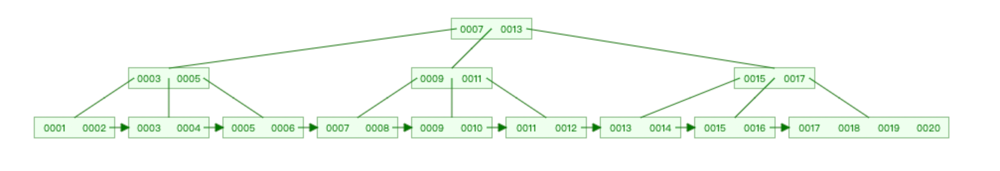
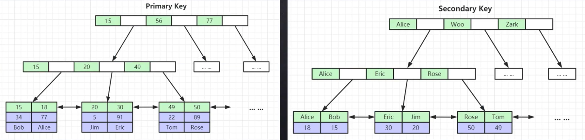
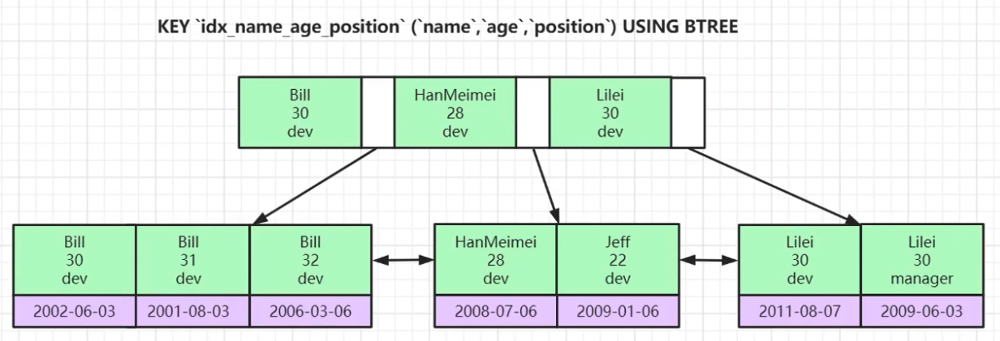

# MySQL索引

---

## 索引

索引是帮助Mysql高效获取数据的排好序的数据结构

优点是提高数据检索效率, 降低数据库IO成本

缺点是会占用磁盘空间, 并且在插入或修改数据的同时也要维护索引, 即降低了效率

索引分为单值索引、复合索引和唯一索引

- 单值索引, 即该索引仅包含一个字段
- 复合索引, 即该索引包含多个字段
- 唯一索引, 即该索引不允许重复, 单允许为空, 唯一索引有单个字段或多个字段组成

还有一个覆盖索引, 其实就是复合索引的一个中用法, 例如select column1, column2, ...

查询的字段column都被复合索引覆盖

## 数据结构

### 二叉树

是一种树状结构, 其中每个节点最多有两个子节点, 分别称为左子节点和右子节点

### 二叉搜索树

是二叉树的一种特殊情况, 简单说就是**左子节点的值比父节点的值小, 右子节点的值比父节点的值大**

参考: [Binary Search Trees](https://www.cs.usfca.edu/~galles/visualization/BST.html)

### 平衡二叉树

是一种特殊的二叉树, 满足如下两个条件:

- 左子树和右子树都是平衡二叉树
- 左子树和右子树的高度差的绝对值不超过1

常见的是AVL树和红黑树, 参考: [AVL Trees (Balanced binary search trees)](https://www.cs.usfca.edu/~galles/visualization/AVLtree.html)、[[Red-Black Trees](https://www.cs.usfca.edu/~galles/visualization/RedBlack.html)]

### BTree(B树)和BPlusTree(B+树)

图形化参考: [B-Tree Visualization (usfca.edu)](https://www.cs.usfca.edu/~galles/visualization/BTree.html) [B+ Tree Visualization (usfca.edu)](https://www.cs.usfca.edu/~galles/visualization/BPlusTree.html)

通过上面两个链接图形化演示, 可以简单概括为:

B树的父节点存储1个或2个数据, 即分摊了数据又减少了树的高度, 同时满足左子节点的值<父节点的值<右子节点的值

B+树相对于B树, 最显著的改变有两点:

- 叶子节点包含所有节点(包括父节点, 冗余的), 即最底层的叶子节点是排好序的所有数据
- 叶子节点用指针连接(相当于链表, 每一块的最后存储下一块的地址)

如图:



MySQL使用的是B+树, 但对B+树做了优化: 

- 父节点存储的数据更多(可以大于2)

- 标准的B+树是单向箭头(想象单向链表), 优化后是双向箭头(想象双向链表), 叶子节点用指针连接(每一块的最后存储下一块的地址, 每一个的最前存储上一块的地址), 提高区间访问(where条件后面的范围查询, 比如大于或小于某个值)的性能

  > PS: 范围查找的结果的数据量很大的时候, 依然会很慢, 此时采用分页即可解决

- 非叶子节点不存储data, 只存储索引, 最底层的叶子节点不仅存储索引, 还存储了数据(字段的值)

MySQL使用B+树存储多个根节点时, 分配到一块连续的磁盘空间(磁盘页, 大小是16KB), 可以通过命令查看:

```mysql
show global status like 'Innodb_page_size';
```

> MySQL一般会将根节点常驻到内存中(减少磁盘I/O), 高版本的MySQL可能会将所有非叶子节点都常驻到内存中
>
> PS: **MySQL是按照页操作的, 例如读取一条数据并不是单独取这一条, 而是将这一条数据所在的页的全部数据放到Buffer Pool中**

B+树的高度说白就是由非叶子节点能存放多少个索引的数量决定的

---

MySIAM索引文件(.myi)和数据文件(.myd)是分离的(**非聚集索引, 又叫非聚簇索引, 又叫稀疏索引**)

InnoDB索引文件和数据文件是一起的(.ibd文件,  **聚集索引, 又叫聚簇索引**), 且聚集索引查到最终数据比非聚集所有快(因为在同一个文件中)

> 对于使用InnoDB的表来说, 有且只能有一个聚集索引

对于InnoDB来说, 表数据文件本身就是按B+树组织的一个所有结构文件, 其聚集索引-叶子节点包含完整的数据记录(主键的数据+其他列的数据)

---

**建议InnoDB表使用整形自增主键的原因:**

- 如果建表时没有设置主键, InnoDB会自动选一列且这列数据没有重复, 当作主键, 如果没有找到不重复的列, 会自动建立一个隐藏的不重复的列(比如用行号row_id)作为主键

- 使用整形作为ID, 而不是UUID, 结合二叉树的数据结构, 可以发现整形比大小的效率比UUID快, 且整形比UUID占用的磁盘空间小

- 使用自增是因为平衡二叉树的原因, 当插入非自增ID时, 要满足 左节点<父节点<右节点 的条件, 需要平衡调整树结构, 影响效率, 而递增	ID, 只需要在最右侧添加节点即可(想象一个Python列表中的append和insert方法)

所以尽量给每张表设置一个整形自增的主键

---

非主键(表中的其他列)索引结构中叶子节点储存的是主键(表中的主键列)的原因: **一致性和节约存储空间**, 如图:



上面说了只有一个聚集索引(包含所有数据), 而其他非主键的索引的叶子节点中存储的data就是主键的值(即节约了空间), 同时减少了复杂度(即插入数据时, 只要主键索引更新完毕, 其他非主键索引引用主键即可, 减少了出错的可能行, 也就是一致性)

**非主键索引, 即二级索引, 也就是非聚集索引, 使用的时候先通过二级索引找到主键, 再通过主键索引查到最终需要的数据, 这就是回表**

联合索引, 又叫复合索引, 即多个字段组合成一个索引, 如图:



这里涉及到一个**索引最左列原理(又叫左列原理)**, 即排序的时候按照字段的顺序, 上图示例中的name、age和position的顺序进行比大小, 然后排序

> **如果, name、age和position比较完毕发现一样, 就不分先后放在一起, 叶子节点的data肯定是主键**
>
> **如果, name、age和position是联合主键, 即三者合一不可能重复, 它本身就是聚集索引, 叶子节点的data存储其他列的数据**

**同时, 使用联合索引时, 需要注意字段的顺序, 如**:

```
select * from table_1 where name='xxx' and age='xxx';  # 使用了索引
select * from table_1 where age='xxx' and position='xxx';  # 未使用索引
select * from table_1 where name='xxx'  # 使用了索引
select * from table_1 where position='xxx'  # 未使用索引

# 这就是最左前缀原理
# why?
# 看上图, 索引就是排好序的数据结构, 所以上图中先排序的name, 然后age, 最后position

# 使用explain语法可以查看索引的使用, 如:
explain select * from table_1 where name='xxx' and age='xxx'; 
```

一般来讲, 一张表中不推荐建立多个单键索引, 基本上都用联合索引

### Hash

其实在MySQL中建立索引时, 除了B+树还可以选择Hash结构

其优点是:

​	对索引的Key进行一次hash计算就可以定位出数据存储的位置

​	很多时候hash所有比B+树所有更高效

其缺点是:

​	仅能满足 = 和 in 的where条件查询, 不支持范围查询

​    对于复合索引, hash是将所有字段组合到一起计算hash值, 所以hash索引无法不支持覆盖索引的用法

​	hash冲突问题或范围查询依然会导致表扫描

所以基本上还是用B+树的多
