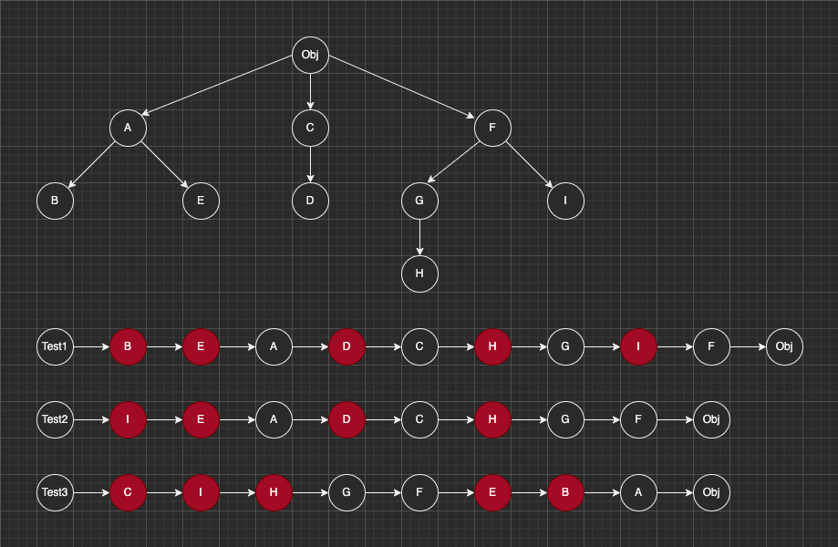

# MRO
---

Python多继承的mro顺序

```python
class A:
    def __init__(self):
        pass
        
        
class B(A):
    def __init__(self):
        pass
        
        
class C:
    def __init__(self):
        pass
        
        
class D(C):
    def __init__(self):
        pass
        
        
class E(A):
    def __init__(self):
        pass
        
        
class F:
    def __init__(self):
        pass
        

class G(F):
    def __init__(self):
        pass


class H(G):
    def __init__(self):
        pass


class I(F):
    def __init__(self):
        pass


class Test1(B, E, D, H, I):
    def __init__(self):
        pass

               
class Test2(I, E, D, H):
    def __init__(self):
        pass
        

class Test3(C, I, H, E, B):
    def __init__(self):
        pass

    

def main():
    print(Test1.__mro__)
    print()
    print(Test2.__mro__)
    print()
    print(Test3.__mro__)


if __name__ == '__main__':
    main()
```

输出:

```
(<class '__main__.Test1'>, <class '__main__.B'>, <class '__main__.E'>, <class '__main__.A'>, <class '__main__.D'>, <class '__main__.C'>, <class '__main__.H'>, <class '__main__.G'>, <class '__main__.I'>, <class '__main__.F'>, <class 'object'>)

(<class '__main__.Test2'>, <class '__main__.I'>, <class '__main__.E'>, <class '__main__.A'>, <class '__main__.D'>, <class '__main__.C'>, <class '__main__.H'>, <class '__main__.G'>, <class '__main__.F'>, <class 'object'>)

(<class '__main__.Test3'>, <class '__main__.C'>, <class '__main__.I'>, <class '__main__.H'>, <class '__main__.G'>, <class '__main__.F'>, <class '__main__.E'>, <class '__main__.B'>, <class '__main__.A'>, <class 'object'>)
```

解释:



Test1 继承 B E D H I, Test2 继承 I E D H, Test3 继承 C I H E B: 

MRO的顺序是:

- 首先, 根据类的括号内的书写顺序继承
- 其次, 当前节点的类的父类的子类都被继承的情况下, 直接继承父类(参见Test1中B->E->A、D->C、H->G)
- 然后, 继承当前节点的类的父类后, 会从新回到同当前节点类同级的其他节点的类开始继承(参见Test2中E->A后变成D->C)
- 接着, 如果继承当前节点的类后发现还有更低级节点的类, 则开始继承更低级节点的类(参见Test3中C->I->H)
- 最后, 统计类的类都继承完成之后, 开始几个Object